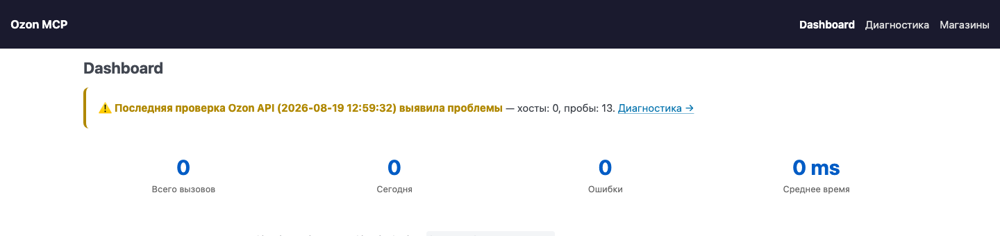
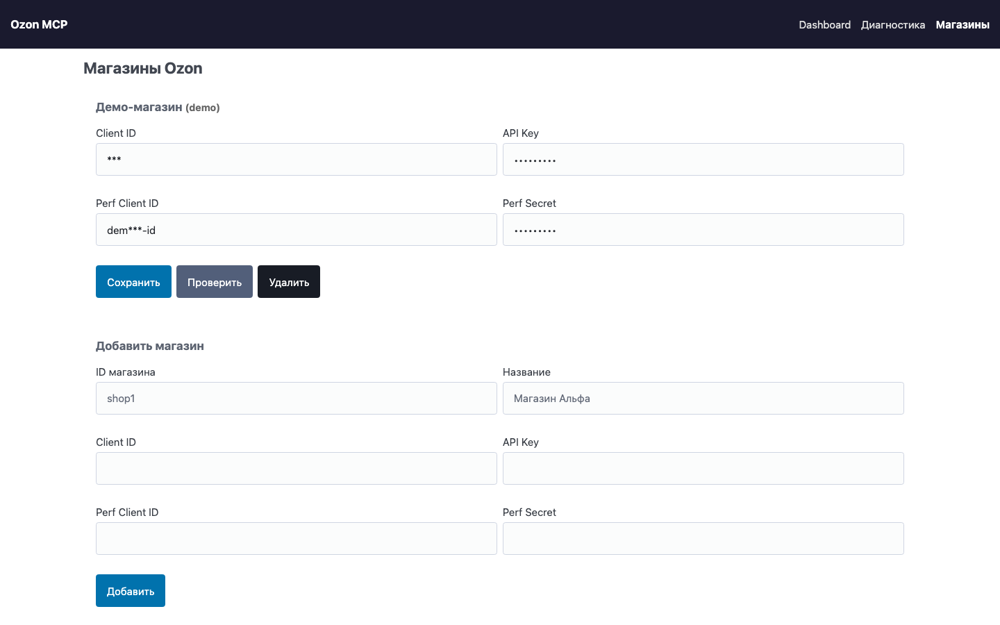
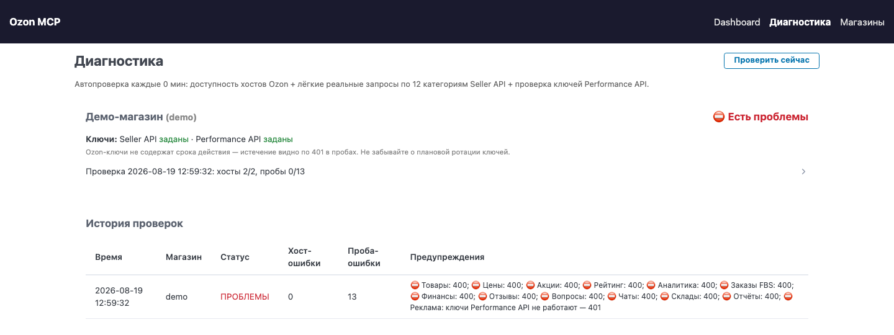

<div align="center">

[](README.md)
[](README.en.md)


</div>

# Ozon MCP Server

[](LICENSE)
[](pyproject.toml)
[](docs/tools.md)
[](https://pypi.org/project/ozon-mcp-server/)
[](#实现原理)

在与 AI 助手的对话中直接打理你的 Ozon 店铺：价格、促销、广告、订单、退货、评价、
财务——基于 Ozon Seller API 与 Performance API 的 151 个工具（Ozon 是俄罗斯最大的
电商平台；Seller API 负责商品与经营，Performance API 负责付费广告）。
专为**经营多家店铺**的卖家设计：每次调用都带 `shop_id`，API 密钥加密保存在你自己的
服务器上，不会外传。
与其他 Ozon MCP 服务器的区别：除 Seller API 外还覆盖广告，并且内置诊断会在 AI 助手
撞上问题之前，先告诉你 Ozon 的哪些接口出了故障。

同时也在 Wildberries 上开店？有一套同样的 WB 服务器：
[wb-mcp-server](https://github.com/DeviceIngineering/wb-mcp-server)。

这是作者自用的生产工具：已经每天使用五个多月，管理约二十个卖家账号，151 个工具。
更新在他自己需要时才做，具体含义见[更新与支持](#更新与支持)。

> `docs/` 里各客户端的安装说明目前**只有俄语版**。不过其中的配置都是可直接粘贴的
> JSON，不依赖语言即可看懂：配置文件路径、地址 `http://localhost:8000/sse`，以及
> 请求头 `Authorization: Bearer <MCP_AUTH_TOKEN>`。

```
你：我的哪些商品 Ozon 打算拉进促销？
你：把本周各广告计划的花费列出来，并停掉那些白烧钱的。
你：哪些商品的价格指数比竞品差？
你：给所有新的五星评价回复一句感谢。
```



## 功能一览

| 分组 | 工具数 | 具体内容 |
|------|--------|----------|
| 促销与折扣 | 14 | Ozon 官方促销（列表、候选商品、加入/退出）、卖家自建促销、买家的「我要折扣」申请 |
| 价格与定价策略 | 14 | 设置售价与最低价、价格指数、最低价计时器、跟踪竞品的自动定价策略 |
| 广告（Performance API） | 22 | Trafarety（Ozon 的推荐位 CPC 广告）投放、出价与预算、Pay-per-order（按成交订单付费，CPO）、按商品与按日统计 |
| 商品 | 21 | 商品列表与详情、属性、库存、导入与批量更新、图片视频、归档、证书 |
| FBS 与 FBO 订单 | 17 | 待处理订单、发货打包（v4）、面单、取消、交接单、原产国 |
| 退货与取消 | 10 | FBO+FBS 统一退货列表、需卖家裁定的 rFBS 退货申请、订单取消申请 |
| 评价、提问、聊天 | 13 | 评价与回复、买家提问、买家聊天会话（v3） |
| 仓库与报表 | 8 | FBS 仓库、配送方式、报表生成与下载 |
| 财务 | 7 | 余额、交易明细、计提、销售实现报表、往来结算、现金流 |
| 类目、品牌、证书 | 7 | 类目树、类目属性及其可选值、证书 |
| 数据分析 | 5 | 按 SKU 的分析、库存与周转、商品在 Ozon 搜索中的排名、热门搜索词 |
| FBO 备货 | 4 | 备货申请单（v3）、状态计数、预约时段 |
| 店铺评分 | 2 | 当前卖家评分及其历史 |
| 诊断 | 2 | Ozon API 可用性自检、接口劣化探测 |
| 通知 | 2 | push webhook 订阅与事件类型字典 |
| 公司信息 | 2 | 卖家主体资料与费率 |
| 店铺 | 1 | 已接入店铺列表及其 `shop_id` |

FBO 与 FBS 是 Ozon 的两种履约模式：FBO 由 Ozon 仓库发货，FBS 由卖家自己的仓库发货，
rFBS 则是卖家自行配送的 FBS。

带编号的完整清单，包含每个工具的说明与参数，见 **[docs/tools.md](docs/tools.md)**。
它由 `ozon_mcp/server.py` 中的 `TOOLS` 常量生成——任意 MCP 客户端调用 `tools/list`
拿到的也是同一份。

## 快速开始

### 方式一：一条命令，无需 Docker

服务器使用 stdio 通信，Claude Desktop、Cursor、VS Code 等 MCP 客户端都以这种方式接入。
无需构建：

```bash
uvx ozon-mcp-server
```

或者用 pip：

```bash
pip install ozon-mcp-server
ozon-mcp
```

客户端配置（以 `claude_desktop_config.json` 为例）：

```json
{
  "mcpServers": {
    "ozon": {
      "command": "uvx",
      "args": ["ozon-mcp-server"],
      "env": {
        "OZON_CLIENT_ID": "你的 Client-Id",
        "OZON_API_KEY": "你的 API 密钥",
        "DATA_DIR": "~/.ozon-mcp"
      }
    }
  }
}
```

`DATA_DIR` 请指向任意可写目录，用于存放店铺、密钥和统计数据。默认值 `/data` 是
Docker 内部使用的路径。

### 方式二：Docker，带网页仪表盘

需要仪表盘、Ozon API 诊断和在浏览器里管理店铺时选这种方式。需要 Docker，五条命令：

```bash
git clone https://github.com/DeviceIngineering/ozon-mcp-server.git
cd ozon-mcp-server
cp .env.example .env               # 内网使用可原样保留
docker compose up -d --build       # 构建镜像并在 8000 端口启动
open http://localhost:8000/shops   # 添加店铺与 Ozon 密钥
```

每一步都在做什么：

- `.env`——所有变量都是可选的。店铺密钥在网页界面里填写更方便，不必写在这里。
  如果服务不止你一个人能访问到，唯一值得先设置的是 `MCP_AUTH_TOKEN`
  （生成方式：`openssl rand -hex 32`）。
- `docker compose up -d --build`——按 `Dockerfile` 构建镜像，映射 `8000:8000` 端口，
  并创建 `ozon_data` 数据卷存放店铺、密钥、调用统计和诊断历史。
  `restart: unless-stopped` 会在机器重启后自动拉起容器。
- `/shops`——添加店铺的表单：`shop_id`（请用拉丁字母，之后在对话里就用它指代店铺）、
  店铺名称、Seller API 的 Client-Id + Api-Key，以及 Performance API 的
  Client-Id + Client-Secret。「Проверить」（测试）按钮会向 Ozon 发一次真实请求，
  告诉你密钥是否可用。

启动之后：

| 地址 | 用途 |
|------|------|
| `http://localhost:8000/` | 仪表盘：调用次数、错误、接口劣化 |
| `http://localhost:8000/shops` | 店铺与密钥 |
| `http://localhost:8000/diagnostics` | Ozon API 诊断 |
| `http://localhost:8000/api/health` | 健康检查接口，返回 JSON |
| `http://localhost:8000/sse` | **MCP 接入地址**，客户端填的就是它 |

请注意，网页界面是俄语的。

停止：`docker compose down`（数据保留在 `ozon_data` 卷中）。
查看日志：`docker compose logs -f`。

### 不使用 Docker

```bash
python3 -m venv .venv && source .venv/bin/activate
pip install .
DATA_DIR=./data PORT=8000 ozon-mcp-web
```

`DATA_DIR` 默认是 `/data`，本地直接运行时务必改成一个你有写权限的目录。

## 接入各客户端

传输方式为 SSE，地址 `http://<host>:8000/sse`。各客户端对 SSE 的支持不一样：有的可以
直连，有的需要 `mcp-remote` 中转。每个客户端都有单独的说明文件，含 macOS、Linux、
Windows 下的配置文件路径和可直接复制的 JSON——**目前只有俄语版**，但其中的 JSON 与
语言无关：

| 客户端 | 是否直连 SSE | 说明文件 |
|--------|--------------|----------|
| Claude Code | 是 | [docs/install-claude-code.md](docs/install-claude-code.md) |
| Claude Desktop | 否，需 `mcp-remote` 中转 | [docs/install-claude-desktop.md](docs/install-claude-desktop.md) |
| Cursor | 是 | [docs/install-cursor.md](docs/install-cursor.md) |
| Windsurf / Devin Desktop | 是 | [docs/install-windsurf.md](docs/install-windsurf.md) |
| VS Code（GitHub Copilot） | 是 | [docs/install-vscode-copilot.md](docs/install-vscode-copilot.md) |
| Cline | 是 | [docs/install-cline.md](docs/install-cline.md) |
| Continue.dev | 是 | [docs/install-continue.md](docs/install-continue.md) |
| Zed | 未经证实，建议用中转 | [docs/install-zed.md](docs/install-zed.md) |
| JetBrains AI Assistant / Junie | 是 | [docs/install-jetbrains.md](docs/install-jetbrains.md) |
| Gemini CLI | 是 | [docs/install-gemini-cli.md](docs/install-gemini-cli.md) |
| OpenAI Codex CLI | 否，需 `mcp-remote` 中转 | [docs/install-codex.md](docs/install-codex.md) |

最短的例子是 Claude Code：

```bash
claude mcp add --transport sse ozon http://localhost:8000/sse \
  --header "Authorization: Bearer <MCP_AUTH_TOKEN>"
```

客户端汇总表和中转工具说明见 [docs/README.md](docs/README.md)。

## 多店铺与安全

店铺在网页界面里添加，每个工具都有必填参数 `shop_id`，可用 `ozon_list_shops` 查询
有哪些店铺。在对话里就是这样用：「看一下 `alpha` 店的库存」。

真正的价值不在于切换本身，而在于**策略只写一次，就能铺到所有账号**：一条关于价格、
评价回复或广告出价的规则，一次性作用于全部店铺——不必反复登录各个卖家后台，也不必
把密钥抄到不同客户端的配置里。

代价是共用一个 IP。所有账号都从同一个地址访问 Ozon，也就是运行 MCP 的那台服务器。
Ozon 的限流也按地址计算，账号越多、策略跑得越勤，总流量就越接近触发限流或封禁的
阈值。

- 代码里**没有**对店铺数量的限制；
- 真正的上限来自 Ozon 的单 IP 限制，而不是这个服务器；
- 二十个左右账号是作者的经验估计，在这个量级流量还处于安全区间；
- 再多就要拆到多台服务器、用不同的地址。

接近上限是可以提前看出来的，而且看的就是网页界面：诊断里失败的 ping 和告警变多，
调用统计里错误占比骤升。两种情况在仪表盘上也能区分开——大面积限流表现为很多工具
同时劣化，而接口下线只表现为其中一个。

密钥是怎么保存的：

- 首次使用时会在 `DATA_DIR` 下生成 `.encryption_key`，即 Fernet 密钥；
- 店铺密钥用它加密后存放在 `DATA_DIR/shops.json`；
- 网页界面里密钥以掩码显示（`abc***xyz`），保存掩码值不会覆盖真实密钥；
- 在 Docker 下这些都在 `ozon_data` 数据卷里。迁移到别的机器时要整卷拷贝，否则加密
  密钥会丢失（见 [DEPLOY.md](DEPLOY.md)，俄语）。

关于访问控制，需要知道：

- `MCP_AUTH_TOKEN` **只**保护 `/sse`。令牌通过 `Authorization: Bearer …` 请求头传递，
  也可以用 `?token=…` 查询参数。
- `MCP_AUTH_TOKEN` 为空即等于关闭鉴权，只有在可信网络里才可以这么做。
- 网页界面（`/`、`/shops`、`/diagnostics`）和 `/api/*` **不受令牌保护**：任何能访问到
  该端口的人都能看到仪表盘，并且能添加店铺。
- 不要把 8000 端口直接暴露到公网。需要远程访问请用 Tailscale 或 VPN。
- 服务器不终止 HTTPS。需要对外提供 TLS，请在前面加反向代理。

## 网页界面：每一次调用都看得见

一般的 MCP 服务器，调用发出去就没影了：助手做了点什么，具体做了什么、用了多久、
报了什么错，只有它自己知道。这里每一次调用都在日志里有一行，每一个出问题的工具都会
在仪表盘上被标出来。对于一个直接操作店铺真金白银的工具来说，这不是装饰，而是敢用它
的前提。

调用统计和检查历史不是造出来的数据：它们来自五个多月、约二十个卖家账号的日常使用。
上面「已知限制」一节里列出的 Ozon API 变更也出自同一处——是从劣化日志里读出来的，
不是从文档里抄的。

### 仪表盘 `/`

截图见本页开头。

- 顶部四个数字：总调用次数、今日调用次数、错误数、平均调用耗时（毫秒）。
- 工具 Top 10：调用次数、平均耗时，以及其中有多少次失败。
- 最近 50 次调用的明细：时间、`shop_id`、工具名、耗时、成功与否以及错误文本。
- 按店铺过滤（`/?shop=alpha`）——同样的数字，只看某一个账号。
- 顶部会浮出两类提示：出现劣化的工具，以及「上一次 Ozon API 检查发现了问题」。

### 店铺 `/shops`



账号可以直接在浏览器里增删，不用改文件，也不用重启容器。「Проверить」（测试）按钮
会向两套 API 各发一次真实请求（`POST /api/shops/{shop_id}/test`），也就是说密钥在
添加时就验证过了，而不是等到任务进行到一半、第一次真正调用时才发现有问题。令牌用
Fernet 加密，加密密钥放在 `DATA_DIR/.encryption_key`，界面上密钥以掩码显示。

### 诊断 `/diagnostics`



*（截图里是一个使用了无效密钥的演示店铺，所以所有探针都是红的）*

- 按店铺显示：密钥是否已填、Ozon 主机可达性、Seller API 的 12 项类别探测、
  Performance API 密钥检查。
- 后台每 `HEALTH_CHECK_INTERVAL_MIN` 分钟检查一次（默认 30，设为 `0` 关闭），
  另有「Проверить сейчас」（立即检查）按钮可手动触发（`POST /api/diagnostics/run`）。
- 检查历史：时间、店铺、状态、ping 失败次数、探测失败次数和告警文本。界面显示最近
  30 条，数据库最多保留 1000 条并自动轮换。
- 同样的数据也可以在对话里用 `ozon_diagnostics` 取到。

### 劣化探测

服务器会自己发现 Ozon 改坏或下线了某个接口——依据既不是文档，也不是「活儿没干成」，
而是它自己的统计数据。某个工具最近连续三次调用都失败、而更早的调用曾经成功，就会被
列入劣化清单，其中会显示工具名、最后一次成功调用的时间、连续出错的次数以及最近一次
的错误文本。在仪表盘上是一条红色提示，在诊断页面上是一张表。

实际意义在于：Ozon 那边的变动当天就能看见，而不是一周后才发现价格一直没更新。
这份清单在对话里用 `ozon_degradations` 也能拿到。

### 供外部监控使用的 JSON

上面这些都可以用程序抓取，而不只是用眼睛看：

| 接口 | 返回内容 |
|------|----------|
| `GET /api/health` | 服务状态、是否开启鉴权、最近几次检查、出现劣化的工具 |
| `GET /api/stats` | 与仪表盘相同的汇总数据；加 `?shop=` 可只看某一个店铺 |
| `GET /api/diagnostics/{shop_id}` | 对某个店铺执行一次完整的实时诊断 |

有了这些就可以把服务器接进 Zabbix、Uptime Kuma，或者干脆用 cron 里的 `curl`。

## 实现原理

一个 Docker 容器，里面是一个 FastAPI 应用，同时充当 MCP 服务器和网页界面。

- **`ozon_mcp/server.py`**——MCP 服务器本体。`TOOLS` 列表描述全部 151 个工具（名称、
  说明、参数的 JSON schema），`call_tool` 处理器把调用路由到对应的 Ozon 客户端方法。
  客户端按 `shop_id` 放在连接池里，因此切换店铺不会重新建连。
- **`ozon_mcp/client.py`**——两个 HTTP 客户端：`OzonSellerClient`（`Client-Id` /
  `Api-Key` 请求头）和 `OzonPerformanceClient`（`client_credentials` 令牌，有效期
  30 分钟，会自动续期）。
- **`ozon_mcp/app.py`**——FastAPI：基于 `SseServerTransport` 的 `/sse` 接口、Bearer
  令牌校验、仪表盘/店铺/诊断三个页面，以及后台健康检查任务。
- **`ozon_mcp/settings.py`**——店铺与密钥：Fernet 加密、界面掩码、把环境变量里的密钥
  识别为名为 `default` 的店铺，以及把旧的单店铺 `settings.json` 迁移成 `shops.json`。
- **`ozon_mcp/diagnostics.py`**——探针：ping Ozon 的主机，外加对 Seller API 的 12 个
  类别各发一个开销很小的真实请求，并检查 Performance API 密钥。
- **`ozon_mcp/stats.py`**——通过 `aiosqlite` 使用 SQLite：记录每次工具调用的耗时与结果、
  健康检查历史，并据此计算接口劣化。

服务器会访问的主机：

| API | 基础 URL | 鉴权方式 |
|-----|----------|----------|
| Seller API | api-seller.ozon.ru | 请求头 `Client-Id` 与 `Api-Key` |
| Performance API（广告） | api-performance.ozon.ru | OAuth `client_credentials`，令牌有效期 30 分钟 |

一些不那么直观的地方：

- Ozon 的广告出价和预算单位是**微卢布**：`1000000` = 1 ₽。看到七位数不用惊讶。
- 评价和提问接口返回 `403` 不是故障，而是没有 Premium Plus 订阅。诊断不会把这类响应
  算作错误。
- 自 2026-02-13 轮换后，Ozon 密钥有了有效期（180 天），并且会显式返回：
  `POST /v1/roles` 会给出 `expires_at`，因此可以提前预警，而不必等探针返回 `401`。
- 广告的异步统计报表：同一时间只能有一个报表，最多 10 个广告计划、最长 62 天；工具最多
  等待约 2 分钟直到报表生成。
- 备货申请单在 API v3 里的状态是 1–8 的整数，不是字符串。

## 环境变量

| 变量 | 默认值 | 作用 |
|------|--------|------|
| `MCP_AUTH_TOKEN` | 空 | `/sse` 的 Bearer 令牌。留空即不鉴权 |
| `HEALTH_CHECK_INTERVAL_MIN` | `30` | 后台诊断间隔（分钟），`0` 表示关闭 |
| `PORT` | `8000` | HTTP 服务端口 |
| `DATA_DIR` | `/data` | 存放 `shops.json`、`stats.db`、`.encryption_key` 的目录 |
| `OZON_CLIENT_ID`、`OZON_API_KEY` | 空 | `default` 店铺的 Seller API 密钥，适合不想在界面里录入的情况 |
| `OZON_PERF_CLIENT_ID`、`OZON_PERF_CLIENT_SECRET` | 空 | 同上，对应 Performance API |

## 已知的 Ozon API 限制（截至 2026 年 6 月）

- 广告：通过 API 只能创建 Trafarety（CPC）计划；预算和出价以微卢布计；官方没有查询
  广告账户余额的方法。
- Pay-per-order：自 2025 年 2 月起出价固定，只能开启或关闭。
- 评价、提问以及部分数据分析需要 Premium Plus 订阅（错误码 7）。
- `ozon_analytics` 中的转化漏斗指标已被 Ozon 标记为废弃——查搜索排名请用
  `ozon_product_queries`。
- **2026 年秋季 Ozon 停用的接口。** 日期来自官方频道 @OzonSellerAPI，并已在真实卖家
  账号上验证（见 [issue #6](https://github.com/DeviceIngineering/ozon-mcp-server/issues/6)，
  感谢 [@standlord-prog](https://github.com/standlord-prog)）：

  | 接口 | 停用日期 | 替代方案 |
  |---|---|---|
  | `/v3/posting/fbs/list` | 2026-08-31 | `/v4/posting/fbs/list` — **v2.1.0 已完成** |
  | `/v2/posting/fbo/list` | 2026-08-31 | `/v3/posting/fbo/list` — **v2.1.0 已完成** |
  | `/v3/posting/fbs/unfulfilled/list` | 2026-08-31 | 无直接替代：改为从 `/v4/posting/fbs/list` 按状态筛选 — **v2.1.0 已完成** |
  | `/v2/posting/fbs/act/create` | 2026-09-07 | `/v1/carriage/create` + `/v1/carriage/approve` — 进行中 |
  | `/v3/finance/transaction/list` | 2026-09-08 | `/v1/finance/accrual/by-day` — 进行中 |
  | `/v3/finance/transaction/totals` | 2026-09-08 | 同上 — 进行中 |

  `/v4/posting/fbs/list` 不是 v3 的改名：`postings` 位于顶层而不是 `result` 之下，
  分页改为游标方式（`has_next` + `cursor`），不再使用 `offset`。
- `ozon_finance_cash_flow` 和 `ozon_finance_accruals` 已经使用新接口
  （`/v1/finance/cash-flow-statement/list`、`/v1/finance/accrual/by-day`）。
- `ozon_product_stocks_by_warehouse` 使用 v2，因为 v1 将于 2026-04-07 停用。
- FBS 电子交接单已被 Ozon 于 2026-03-22 移除，改用普通交接单。
- Ozon API 没有「修改评价回复」的方法：只能删除原回复后重新发布。

这份清单不是照抄文档：它来自接口劣化日志和五个多月的日常调用，并对照
docs.ozon.ru 截至 2026 年 6 月的文档做了核对。

## 2.0 版本的变化

对照 2026 年 6 月的 Ozon API 做了一轮彻底梳理，并逐个发真实请求核对过，而不是只看文档：
统一退货列表、取消 v2、销售实现 v2、ship v4、supply-order v3、真正可用的定价策略与
「我要折扣」、卖家自建促销、新的广告模型（Trafarety CPC + Pay-per-order）、诊断与劣化
探测，以及 MCP 接口的鉴权。

## 项目结构

```
ozon-mcp-server/
├── docker-compose.yml   # 8000 端口，ozon_data 数据卷
├── Dockerfile           # python:3.12-slim, uvicorn
├── DEPLOY.md            # 部署到独立机器、迁移数据
├── docs/                # 各客户端接入说明 + 工具清单
└── ozon_mcp/
    ├── server.py        # MCP 服务器：151 个工具，多店铺
    ├── client.py        # Seller API + Performance API
    ├── app.py           # FastAPI：SSE、网页、鉴权、健康检查循环
    ├── diagnostics.py   # 类别探针、劣化探测
    ├── settings.py      # 店铺与密钥（Fernet）
    ├── stats.py         # 调用统计与检查历史（SQLite）
    └── templates/       # dashboard、diagnostics、shops
```

部署到独立机器以及迁移店铺数据见 [DEPLOY.md](DEPLOY.md)（俄语）。

## 面向 Wildberries 的同款服务器

[**wb-mcp-server**](https://github.com/DeviceIngineering/wb-mcp-server) 是同一套工具
在另一个平台上的版本（Wildberries 是俄罗斯另一家大型电商平台）：架构相同，网页界面、
仪表盘和诊断相同，同样用 `shop_id` 管理多店铺，同样走 SSE，客户端接入方式也一样。

|  | Ozon MCP Server | WB MCP Server |
|---|---|---|
| 端口 | 8000 | 8001 |
| 工具数 | 151 | 202 |
| API | Ozon Seller API + Performance API（广告） | Wildberries Seller API |

实际意义有两点：

- **上手第二套不用重新学。** 一套跑通了，另一套照着同样的步骤启动即可；区别只在端口
  （8001 而不是 8000）和工具集。
- **两套可以装在同一台机器上。** 端口不同，数据分别放在各自的 Docker 卷里，不会冲突。
  在客户端里它们就是两个 MCP 服务器：`ozon` 用 `http://localhost:8000/sse`，
  `wb` 用 `http://localhost:8001/sse`。

放在同一台机器上也不会因为限流而互相拖累：两者出网 IP 相同，但 Ozon 和 Wildberries
各自统计自己的配额——它们是不同的平台。多店铺一节里说的账号数量上限，是在每个平台
内部分别生效的。

## 更新与支持

Ozon 一直在改 API：接口会新增、改名、下线（上面的限制一节列的就是目前已经踩到的）。
这个服务器是作者自用的生产工具，**他自己需要时才更新**——也就是某次改动弄坏了他自己
店铺的功能的时候。已经连续用了五个多月，提交出现在 Ozon 改坏了什么的时候，而不是
按发布计划：两次提交之间没动静，通常说明一切正常。好处是这份代码每天都在真实业务里
被验证，而不是发布完就没人管了；代价是没有发布计划，也不承诺响应时限。

如果你急需某项修复，请发邮件到 **d0371153@gmail.com**。
也欢迎提 issue 和 pull request，它们都会被认真看。

## 致谢

- [@standlord-prog](https://github.com/standlord-prog)：
  - [issue #6](https://github.com/DeviceIngineering/ozon-mcp-server/issues/6) —— 整理了
    Ozon 即将停用的接口，并在真实卖家账号上做了验证：停用日期、替代方案，以及迁移到
    `/v4` 时的三个坑。另外还提醒：`/v1/carriage/create` 没有任何必填字段，空请求体 `{}`
    会创建真实的发货单；以及 `POST /v1/roles` 会返回 `expires_at` 这一更正。
    **v2.1.0** 正是基于这些工作完成的。
  - [PR #7](https://github.com/DeviceIngineering/ozon-mcp-server/pull/7) —— 发现并修复了
    「诊断失明」问题：在 stdio 模式下调用统计根本没有初始化，因此 `ozon_degradations`
    对任何询问都回答「没有劣化」——哪怕每一次调用都在失败。该工具标记为 [P0]，
    恰恰是在出问题时才会被调用，所以这种无声的假阴性比没有这个工具更糟。
    这个 PR 不只修好了初始化，还把「没有数据」和「没有劣化」区分开，
    并补充了用真实 MCP 客户端跑 stdio 的集成测试。已包含在 **v2.1.2** 中。

## 许可证

MIT——见 [LICENSE](LICENSE)。
